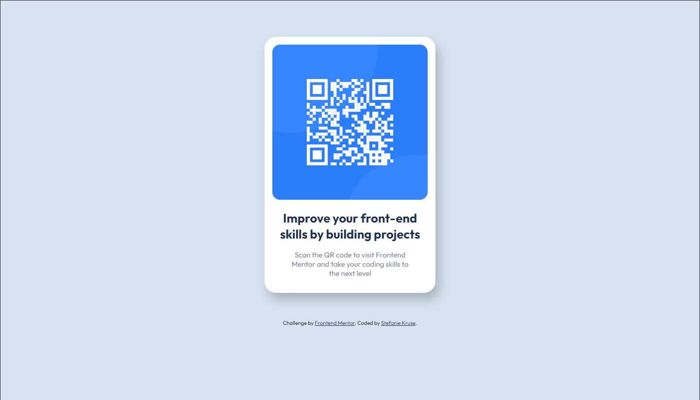

# Frontend Mentor - QR code component solution

This is a solution to the [QR code component challenge on Frontend Mentor](https://www.frontendmentor.io/challenges/qr-code-component-iux_sIO_H). Frontend Mentor challenges help you improve your coding skills by building realistic projects. 

## Table of contents

- [Overview](#overview)
  - [Screenshot](#screenshot)
  - [Links](#links)
- [My process](#my-process)
  - [Built with](#built-with)
  - [What I learned](#what-i-learned)
  - [Next steps](#next-steps)
- [Author](#author)
- [Acknowledgments](#acknowledgments)

**Note: Delete this note and update the table of contents based on what sections you keep.**

## Overview

### Screenshot

### Links

- Solution URL: [Add solution URL here](https://your-solution-url.com)
- Live Site URL: [Add live site URL here](https://your-live-site-url.com)

## My process

### Built with

- HTML5 markup
- CSS custom properties
- Mobile-first workflow

### What I learned

- applying HTML and CSS to a new project
- refreshed Git basics and publishing my work on GitHub pages

### Next steps

- learning flexbox and applying it to the next project

## Author

Hi! I am Stefanie, a sustainable product designer currently learning some frontend coding to broaden my skillset.

- Visit my website - [rethink-product.com](https://rethink-product.com)
- Linkedin - [Stefanie Kruse](https://https://www.linkedin.com/in/stefaniekruse/)
- Frontend Mentor - [@stefanie-rethink-product](https://www.frontendmentor.io/profile/stefanie-rethink-product)

## Acknowledgments

Kudos to Colt Steele from [The Web Developer Bootcamp 2023](https://www.udemy.com/course/the-web-developer-bootcamp/) on Udemy, who did an awesome job in teaching the basics of HTML and CSS in just 2 days. And thanks to [TechLabs Hamburg](https://techlabs.org/location/hamburg) for sponsoring my learning journey.
