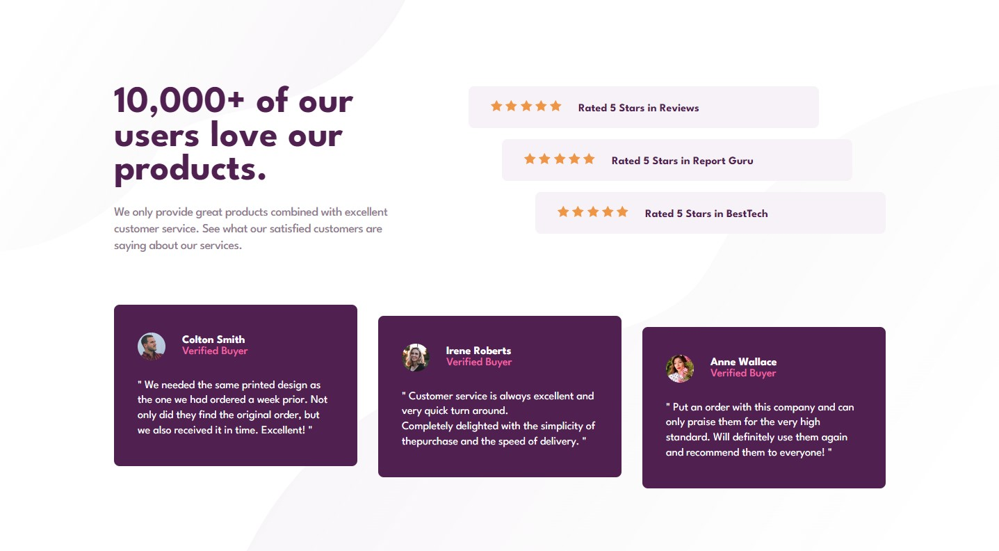

# Frontend Mentor - Social proof section solution

This is a solution to the [Social proof section challenge on Frontend Mentor](https://www.frontendmentor.io/challenges/social-proof-section-6e0qTv_bA). Frontend Mentor challenges help you improve your coding skills by building realistic projects. 

## Table of contents

- [Overview](#overview)
  - [The challenge](#the-challenge)
  - [Screenshot](#screenshot)
  - [Links](#links)
- [My process](#my-process)
  - [Built with](#built-with)
  - [What I learned](#what-i-learned)
  - [Continued development](#continued-development)
- [Author](#author)
- [Acknowledgments](#acknowledgments)

## Overview

### The challenge

Users should be able to:

- View the optimal layout for the section depending on their device's screen size

### Screenshot

### Links

- [Solution URL](https://github.com/stefanie-rethink-product/frontend-mentor/tree/main/004-social-proof-section-main)
- [Live Site URL](https://stefanie-rethink-product.github.io/frontend-mentor/004-social-proof-section-main/)

## My process

### Built with

- Semantic HTML5 markup
- CSS custom properties
- Flexbox
- Mobile-first workflow

### What I learned

- creating a third layout optimzed for tablet breakpoints
- practiced using media queries, flexbox, and transform

### Continued development

- further practice of flexbox layouts
- learn to use CSS grid

## Author

Hi! I am Stefanie, a sustainable product designer currently learning some frontend coding to broaden my skillset.

- Visit my website - [rethink-product.com](https://rethink-product.com)
- Linkedin - [Stefanie Kruse](https://https://www.linkedin.com/in/stefaniekruse/)
- Frontend Mentor - [@stefanie-rethink-product](https://www.frontendmentor.io/profile/stefanie-rethink-product)

## Acknowledgments

Kudos to Colt Steele from [The Web Developer Bootcamp 2023](https://www.udemy.com/course/the-web-developer-bootcamp/) on Udemy, who did an awesome job in teaching the basics of HTML and CSS in just 2 days. And thanks to [TechLabs Hamburg](https://techlabs.org/location/hamburg) for sponsoring my learning journey.